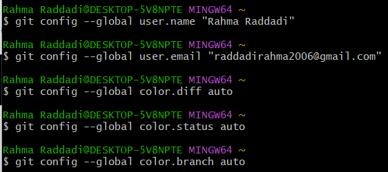

# Lab 1 — Git Intro

## 1. Installation et vérification de Git
```bash
git --version
```


## 2. Configuration de Git
```bash
git config --global user.name "..."
git config --global user.email "..."
git config --list
```



## 3. Création d'un dépôt local
```bash
git init
```


## 4. Clonage d'un dépôt
```bash
git clone <URL>
```


## 5. Modifications et commits


## 6. Visualisation de l'historique
```bash
git log
```


## 7. Annulation d'un commit


## Conclusion
Ce laboratoire a permis de pratiquer l'installation, la configuration, les dépôts locaux, les commits, l'historique, le clonage et l'annulation de commits.
