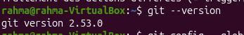
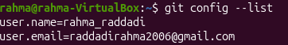
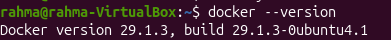
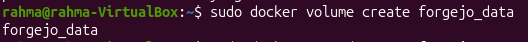

# Lab 4 — Git et Forgejo

## 1. Installation de Git
```bash
git --version
```


## 2. Configuration de Git
```bash
git config --list
```


## 3. Docker
```bash
docker --version
```


## 4. Volume Forgejo
```bash
sudo docker volume create forgejo_data
```


## 5. Conteneur Forgejo
```bash
sudo docker ps
```


## 6. Dépôt Forgejo


## 7. Trois commits
```bash
git log --oneline
```


## 8. Publication
```bash
git push -u origin master
```


## 9. Clonage
```bash
git clone http://10.0.2.15:3000/rahma_raddadi/tp-forgejo.git
```


## 10. Synchronisation
La synchronisation finale a donné :
```text
Everything up-to-date
```

## Conclusion
Ce laboratoire a permis de mettre en pratique Git, Docker et Forgejo, puis de publier, cloner et synchroniser un dépôt.
